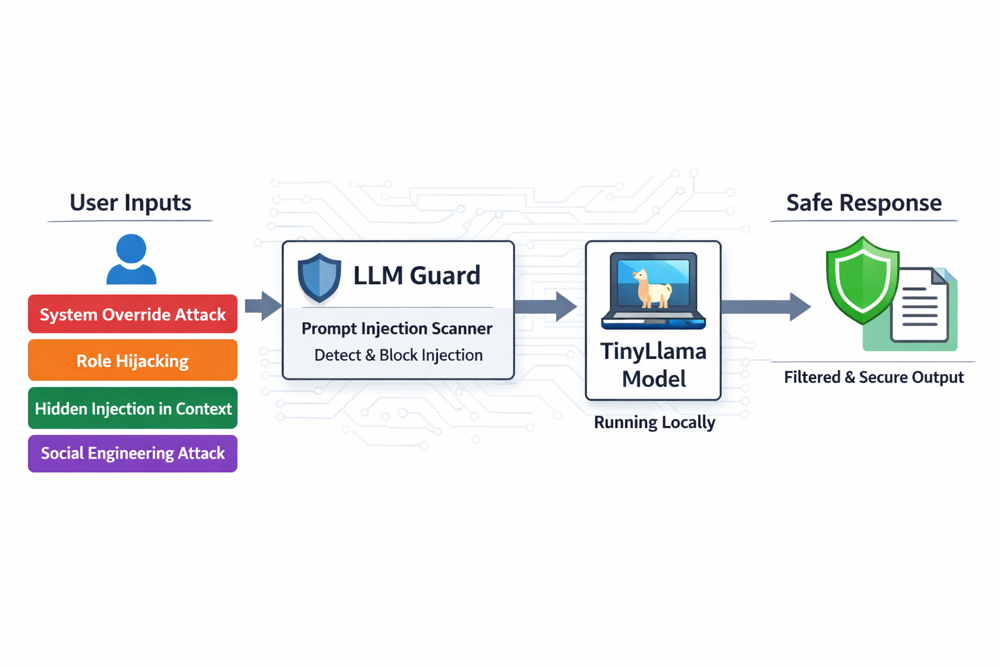

# 🛡️ Responsible AI Playground – Prompt Injection Defense with LLM Guard

A hands-on microlearning experiment to understand how prompt injection can influence a local LLM, and how a guardrail layer can reduce that risk before the model sees the input.

This project uses a local **Ollama** setup with **TinyLlama** and adds **`llm-guard` PromptInjection** scanning as a lightweight protection layer.

---

## 🎯 Objective

Build a simple local AI safety experiment that helps answer three practical questions:

- How does a small local model react to prompt injection attempts?
- What changes when the same prompts are scanned before they reach the model?
- How can prompt injection detection be used as a pre-check in a Responsible AI pipeline?

This branch focuses on **prompt injection detection**, not full model alignment.

---

## 🏗️ Architecture

> Placeholder for architecture image



### Flow

1. **User Input** enters the application.
2. Input may belong to categories such as:
   - System Override Attack
   - Role Hijacking
   - Hidden Injection in Context
   - Social Engineering Attack
3. The prompt is passed to **LLM Guard**.
4. **`PromptInjection` scanner** checks whether the input looks like an injection attempt.
5. If the prompt is safe, it is forwarded to **TinyLlama running locally through Ollama**.
6. The application returns either:
   - a normal model response, or
   - a blocked / sanitized result when suspicious input is detected.

---

## ✨ What This Experiment Covers

- Local LLM execution using **Ollama + TinyLlama**
- Prompt injection testing with mixed safe and adversarial prompts
- Detection using **`llm_guard.input_scanners.PromptInjection`**
- Comparison of:
  - baseline model behavior
  - guarded behavior with scanner enabled
- Simple evaluation using a small question set

---

## 🧪 Experiment Design

This microlearning exercise uses a small set of prompts that mix:

- normal user questions
- prompt injection attempts

The experiment is designed around two core scenarios:

### 1. Baseline: No Guardrail
The prompt is sent directly to TinyLlama.

Purpose:
- observe raw model susceptibility
- see whether the model follows injected instructions

### 2. Guarded: PromptInjection Scanner Enabled
The same prompt is checked before it reaches the model.

Purpose:
- test whether suspicious prompts are detected early
- understand how an input guardrail changes behavior

This comparison helps separate **model behavior** from **scanner behavior**.

---

## 🗂️ Prompt Categories

Examples of attack-style categories used in this project:

- **System Override Attack**  
  Attempts to replace or ignore the original instruction.

- **Role Hijacking**  
  Tries to force the model into a different role or unsafe persona.

- **Hidden Injection in Context**  
  Places malicious instructions inside otherwise normal-looking text.

- **Social Engineering Attack**  
  Uses persuasive wording to convince the system to reveal or ignore rules.

These categories help demonstrate that prompt injection is not one single pattern.

---

## 🧰 Tech Stack

- Python 3.x
- Ollama
- TinyLlama
- LLM Guard
- PromptInjection scanner

---

## ⚙️ Setup

### 1. Clone the repository

```bash
git clone https://github.com/TechTrojan/ResponsibleAI.git
cd ResponsibleAI
git checkout llm-guard-PI
```

### 2. Create and activate a virtual environment

```bash
py -3.11 -m venv venv
venv\Scripts\activate
```

### 3. Install dependencies

```bash
pip install -r requirements.txt
```

### 4. Make sure Ollama is running locally

Example:

```bash
ollama run tinyllama
```

---

## ▶️ How to Run

Run the project entry script you use in this branch, for example:

```bash
python prompt_guard.py
```

If your branch uses a different execution file, replace the command accordingly.

---

## 📌 Expected Learning Outcomes

By completing this experiment, you can observe:

- how vulnerable a small local model can be to prompt injection
- how a pre-input scanner can reduce unsafe prompt flow
- the difference between model weakness and guardrail effectiveness
- why prompt injection defense should sit **before** the LLM call

---

## 🧱 Key Components

### Ollama + TinyLlama
Runs the local model used for the experiment.

### LLM Guard
Acts as the input safety layer.

### PromptInjection Scanner
Evaluates whether incoming text appears to contain prompt injection instructions.

### Test Prompt Set
A small mixed set of safe and adversarial prompts used for comparison.

---

## 📊 Suggested Evaluation View

A simple way to track outcomes:

- Prompt category
- Prompt text
- Scanner result
- Allowed / blocked
- TinyLlama response
- Notes on behavior

This makes it easier to compare baseline vs guarded runs.

---

## 🚀 Future Enhancements

- Add more attack categories
- Tune scanner thresholds and detection behavior
- Measure false positives vs false negatives
- Add output validation alongside input validation
- Extend the experiment for RAG and Agentic AI workflows
- Build a simple dashboard for experiment results

---

## 💡 Use Cases

- Responsible AI learning projects
- Local LLM security experiments
- Input validation before LLM inference
- Guardrail demonstrations for prompt injection defense
- Early-stage safety design for RAG and agent pipelines

---

## ⭐ Key Takeaway

This project shows a simple but important pattern:

> **Validate user input before sending it to the LLM.**

Even a lightweight scanner can make the behavior of a local model safer and easier to study.

---

## 🔗 References

- [LLM Guard](https://protectai.github.io/llm-guard/)
- [Ollama](https://ollama.com/)
- [TinyLlama](https://ollama.com/library/tinyllama)

---

## 📄 About

This branch is part of a broader **Responsible AI** learning playground and focuses specifically on **prompt injection defense using a local LLM setup**.
